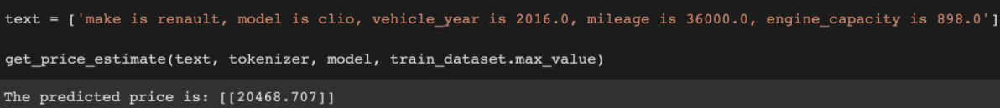
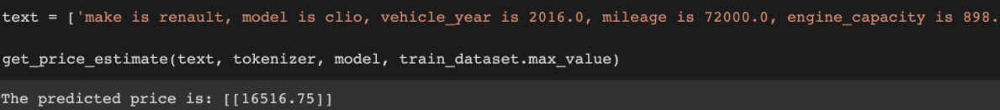

# FSDL-2021-project
## Final project for the Full Stack Deep Learning 2021 course 

### Overwiew
I work for OLX, an on-line classifieds company with 20+ brands all around the world. In particular, I have access to a dataset of car listings. We also have a system in production for listing price prediction based on XGBoost that uses string/numerical tabular data such as car manufacturer, model, mileage, year and so on. The users of our platforms can also enter a free text description with additional information. Currently this data is not used for price prediction. 

The **main assumption** of this project was that the current error in the price prediction could be reduced not by replacing the XGBoost model but by *integrating it with a NLP model trained on the free text data and the difference between the predicted price and the actual listing price*. 

Despite several attempts at fine-tuning a Hugging Face BERT model for both classification and regression, using different input and target features,  I did not have success in training the model to reduce the current production system error. 

However, I have then explored **other application scenarios**, and found that the most interesting results came from transforming the tabular feature values into text and using it to *directly predict the price*, with a Median Absolute Percentage error of 9.8. Additionally, I explored the use case of using the description string to classify whether the user who posted the ad is a professional or not, obtaining an F1 score of 97%.

All the results were achieved using Hugging Face BERT models and Google Colab Pro.

The repo contains two notebooks, one used for regression problems and one for classification. 

The following is an example of a fine-tuned BERT mode predict a car price prediction based on a text query:

Interestingly, the model is able to learn that car prices decrease when mileage increase, while all other features stay the same.

